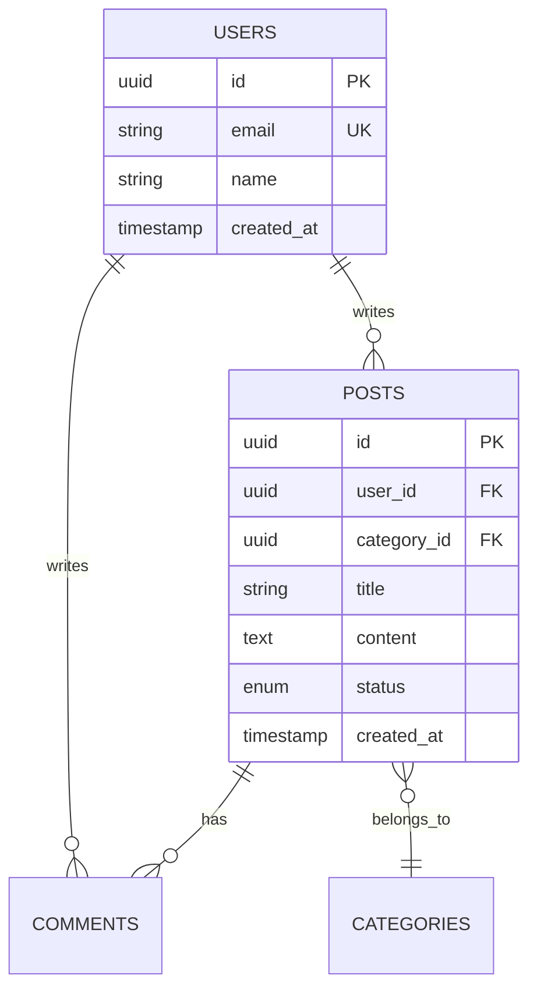

# DB Specification Template — DB 명세서

## 문서 구조

```markdown
# [프로젝트명] — DB 명세서 (Database Specification)

> 버전: 1.0 | 작성일: YYYY-MM-DD | 기반 문서: SDS v1.0

---

## 1. 개요

### 1.1 데이터베이스 선택
| 항목 | 내용 |
|------|------|
| DBMS | [예: PostgreSQL 16] |
| 선택 근거 | [왜 이 DB를 선택했는가] |
| 호스팅 | [예: AWS RDS / Supabase / Self-hosted] |
| 관련 설계 | DES-XXX |

### 1.2 설계 원칙
- 정규화 수준 (예: 3NF 기본, 읽기 성능이 중요한 곳은 비정규화 허용)
- 소프트 삭제 vs 하드 삭제 정책
- 타임스탬프 규칙 (created_at, updated_at 필수 등)
- 네이밍 컨벤션 (snake_case, 복수형 테이블명 등)

---

## 2. ER 다이어그램



---

## 3. 테이블 상세

### DB-001: [테이블명] (예: users)

#### 기본 정보
| 항목 | 내용 |
|------|------|
| 관련 요구사항 | REQ-F-001, REQ-F-002 |
| 관련 설계 | DES-001 |
| 예상 레코드 수 | [예: 초기 10K → 1년 후 100K] |
| 파티셔닝 | [필요 시 전략] |

#### 컬럼 정의
| 컬럼명 | 타입 | 제약조건 | 기본값 | 설명 |
|--------|------|---------|--------|------|
| id | UUID | PK | gen_random_uuid() | 기본 키 |
| email | VARCHAR(255) | UNIQUE, NOT NULL | - | 사용자 이메일 |
| password_hash | VARCHAR(255) | NOT NULL | - | bcrypt 해시 |
| name | VARCHAR(100) | NOT NULL | - | 표시 이름 |
| role | ENUM('user','admin') | NOT NULL | 'user' | 사용자 역할 |
| is_active | BOOLEAN | NOT NULL | true | 활성 상태 |
| last_login_at | TIMESTAMP | - | NULL | 마지막 로그인 |
| created_at | TIMESTAMP | NOT NULL | NOW() | 생성 시각 |
| updated_at | TIMESTAMP | NOT NULL | NOW() | 수정 시각 |
| deleted_at | TIMESTAMP | - | NULL | 소프트 삭제 |

#### 인덱스
| 인덱스명 | 컬럼 | 유형 | 근거 |
|----------|------|------|------|
| idx_users_email | email | UNIQUE | 로그인 시 이메일 조회 |
| idx_users_role | role | BTREE | 역할별 필터링 |
| idx_users_created | created_at | BTREE | 최신 가입순 정렬 |

#### 주요 쿼리 패턴
| 설명 | 예상 빈도 | 사용 인덱스 |
|------|----------|-----------|
| 이메일로 사용자 조회 | 높음 | idx_users_email |
| 역할별 목록 조회 | 중간 | idx_users_role |

---

### DB-002: [테이블명]
(위와 동일한 구조)

---

## 4. 관계 정의

| 관계 | 테이블 A | 테이블 B | 유형 | FK 컬럼 | ON DELETE |
|------|---------|---------|------|---------|----------|
| 사용자-게시물 | users | posts | 1:N | posts.user_id | CASCADE / SET NULL |
| 게시물-댓글 | posts | comments | 1:N | comments.post_id | CASCADE |

---

## 5. Enum / 상수 정의

| Enum 이름 | 값 | 사용 테이블 |
|----------|-----|-----------|
| user_role | user, admin | users.role |
| post_status | draft, published, archived | posts.status |

---

## 6. 마이그레이션 전략

### 6.1 도구
- [예: Prisma Migrate / Alembic / Flyway / raw SQL]

### 6.2 규칙
- 마이그레이션은 항상 롤백 가능하도록 작성
- 컬럼 삭제 전 deprecation 기간 부여
- 대량 데이터 마이그레이션은 별도 스크립트로 분리

### 6.3 시딩 (Seed Data)
| 테이블 | 시드 데이터 | 환경 |
|--------|-----------|------|
| users | 관리자 계정 | 전체 |
| categories | 기본 카테고리 | 전체 |

---

## 7. 성능 고려사항

### 7.1 예상 부하
| 테이블 | 읽기/초 | 쓰기/초 | 크기 (1년) |
|--------|---------|---------|-----------|
| users | 100 | 5 | ~10MB |
| posts | 500 | 20 | ~1GB |

### 7.2 캐싱 전략
| 대상 | 캐시 방식 | TTL | 무효화 조건 |
|------|----------|-----|------------|
| 사용자 프로필 | Redis | 1h | 프로필 수정 시 |

### 7.3 파티셔닝 / 샤딩 (해당 시)
- 파티셔닝 기준과 전략

---

## 8. 백업 및 복구

| 항목 | 정책 |
|------|------|
| 자동 백업 | [예: 일 1회, 7일 보존] |
| 복구 목표 시간 (RTO) | [예: 1시간] |
| 복구 목표 시점 (RPO) | [예: 최근 1시간] |

---

## 9. DB 추적

| DB ID | 테이블 | REQ ID | DES ID |
|-------|--------|--------|--------|
| DB-001 | users | REQ-F-001 | DES-001 |
| DB-002 | posts | REQ-F-003 | DES-002 |

---

## 변경 이력

| 버전 | 날짜 | 변경 내용 | 작성자 |
|------|------|----------|--------|
| 1.0 | YYYY-MM-DD | 초안 작성 | [이름] |
```

## 작성 가이드

- **인덱스에 근거를 붙인다**: 모든 인덱스는 "왜 필요한가"를 설명. 무작정 인덱스를 추가하면 쓰기 성능이 저하된다.
- **쿼리 패턴 기반 설계**: 테이블 설계 전에 예상 쿼리 패턴을 먼저 정리하면 인덱스와 비정규화 결정이 쉬워진다.
- **예상 규모 명시**: 각 테이블의 예상 데이터량을 기록. 규모에 따라 설계가 달라질 수 있다.
- **ON DELETE 정책**: FK마다 CASCADE/SET NULL/RESTRICT 중 적절한 것을 명시. 실수로 CASCADE가 연쇄 삭제를 일으키는 사고를 방지.
- **타임존**: TIMESTAMP는 항상 UTC 저장. 표시할 때 변환. 이 규칙을 명시적으로 기록.
