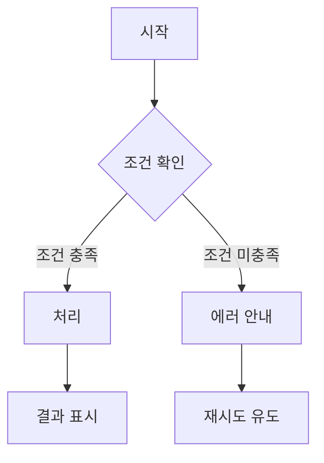
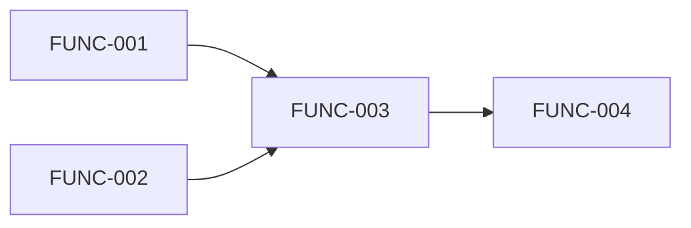

# Functional Specification Template — 기능명세서

## 문서 구조

```markdown
# [프로젝트명] — 기능명세서 (Functional Specification)

> 버전: 1.0 | 작성일: YYYY-MM-DD | 기반 문서: SRS v1.0

---

## 1. 개요

이 문서는 각 기능의 상세 동작을 정의한다.
SRS가 "무엇을 만들 것인가"를 정의했다면, 이 문서는 "사용자 관점에서 구체적으로 어떻게 동작하는가"를 설명한다.

---

## 2. 기능 상세

### FUNC-001: [기능명]

#### 기본 정보
| 항목 | 내용 |
|------|------|
| 관련 요구사항 | REQ-F-001, REQ-F-002 |
| 관련 설계 | DES-001 |
| 우선순위 | P0 |
| 사용자 역할 | [이 기능을 사용하는 역할] |

#### 기능 설명
[2-3문장으로 이 기능이 무엇인지 설명]

#### 사전 조건 (Preconditions)
- [이 기능이 실행되기 위해 충족되어야 하는 조건]

#### 사용자 플로우



**정상 플로우 (Happy Path)**:
1. 사용자가 [행동]
2. 시스템이 [처리]
3. 사용자에게 [결과 표시]

**대안 플로우 (Alternative Path)**:
- [조건]인 경우: [다른 처리 경로]

#### 입력 사양
| 필드 | 타입 | 필수 | 유효성 규칙 | 예시 |
|------|------|------|------------|------|
| [필드명] | string | Y | [규칙] | [예시] |
| [필드명] | number | N | [규칙] | [예시] |

#### 출력 사양
| 항목 | 설명 | 예시 |
|------|------|------|
| 성공 시 | [결과 설명] | [예시] |
| 실패 시 | [에러 메시지] | [예시] |

#### 비즈니스 규칙
- BR-001: [규칙 설명. 예: "하루 최대 5회까지만 시도 가능"]
- BR-002: [규칙 설명]

#### 예외 처리
| 예외 상황 | 시스템 동작 | 사용자 안내 |
|----------|-----------|-----------|
| [상황] | [처리] | [메시지] |

#### UI 요구사항 (해당 시)
- 화면 레이아웃 설명 또는 와이어프레임 참조
- 반응형 동작 (모바일/태블릿/데스크톱)
- 로딩 상태, 빈 상태, 에러 상태 처리

---

### FUNC-002: [기능명]
(위와 동일한 구조)

---

## 3. 기능 간 의존성



| 기능 | 선행 기능 | 설명 |
|------|----------|------|
| FUNC-003 | FUNC-001, FUNC-002 | [의존 이유] |

---

## 4. 기능 추적

| FUNC ID | SRS (REQ) | SDS (DES) | 우선순위 |
|---------|-----------|-----------|---------|
| FUNC-001 | REQ-F-001, REQ-F-002 | DES-001 | P0 |
| FUNC-002 | REQ-F-003 | DES-002 | P1 |

---

## 변경 이력

| 버전 | 날짜 | 변경 내용 | 작성자 |
|------|------|----------|--------|
| 1.0 | YYYY-MM-DD | 초안 작성 | [이름] |
```

## 작성 가이드

- **사용자 관점으로 작성**: 기술 구현이 아니라 사용자가 경험하는 흐름에 초점.
- **Happy Path + Edge Case**: 정상 플로우만이 아니라 예외 상황도 반드시 다룬다. 실제 버그의 대부분은 엣지 케이스에서 발생한다.
- **입출력을 구체적으로**: 타입, 유효성 규칙, 예시까지 명시. 개발자가 이 표만 보고 구현할 수 있어야 한다.
- **비즈니스 규칙 분리**: 로직에 묻히기 쉬운 비즈니스 규칙을 별도로 정리하면 나중에 규칙 변경 시 영향 파악이 쉽다.
- **기능 단위 결정**: 하나의 FUNC은 사용자가 인식하는 하나의 독립적 행동 단위. 너무 크면 분할, 너무 작으면 합친다.
