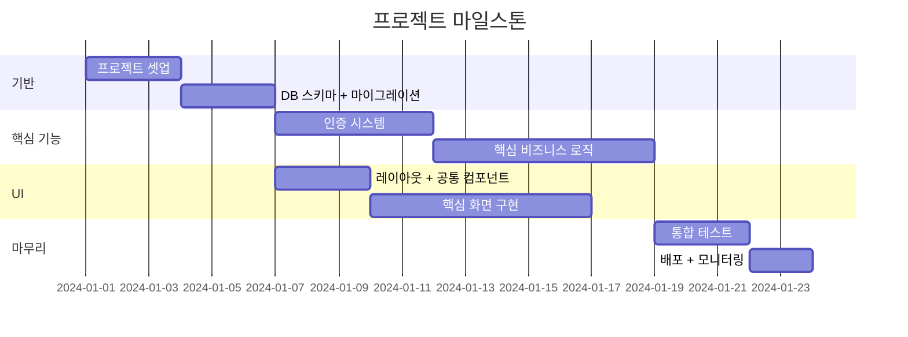
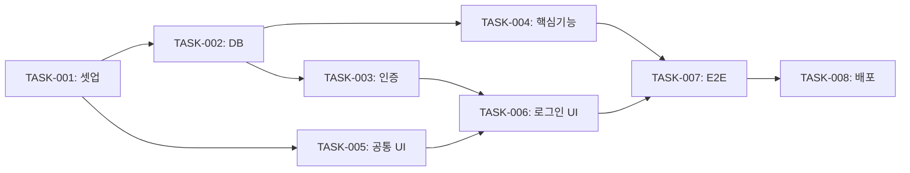

# Implementation Plan Template — 구현 계획서

## 문서 구조

```markdown
# [프로젝트명] — 구현 계획서 (Implementation Plan)

> 버전: 1.0 | 작성일: YYYY-MM-DD | 기반 문서: SDS v1.0, FUNC-SPEC v1.0, TEST-SPEC v1.0

---

## 1. 개요

### 1.1 목적
설계 문서를 실제 구현 태스크로 분해하여, 개발 순서와 일정을 명확히 한다.
이 문서를 기반으로 이슈 트래커(GitHub Issues, Jira 등)에 태스크를 생성한다.

### 1.2 구현 전략
- **접근 방식**: [예: 수직 슬라이스 (기능 단위) / 수평 레이어 (인프라→백엔드→프론트)]
- **반복 주기**: [예: 1주 스프린트 / 2주 스프린트]
- **MVP 범위**: [예: BIZ-001 ~ BIZ-003 (P0 항목)]

---

## 2. 마일스톤



| 마일스톤 | 포함 기능 (BIZ) | 목표일 | 완료 기준 |
|---------|----------------|--------|----------|
| M1: 프로젝트 셋업 | - | YYYY-MM-DD | 개발 환경 구성, CI/CD 파이프라인, DB 초기화 |
| M2: MVP | BIZ-001 ~ BIZ-003 | YYYY-MM-DD | P0 기능 동작, 핵심 테스트 통과 |
| M3: Beta | BIZ-004 ~ BIZ-006 | YYYY-MM-DD | P1 기능 포함, E2E 테스트 통과 |
| M4: Release | 전체 | YYYY-MM-DD | 전체 기능, 성능/보안 테스트 통과 |

---

## 3. 태스크 상세

### Phase 1: 프로젝트 기반 구축

#### TASK-001: 프로젝트 초기 셋업
| 항목 | 내용 |
|------|------|
| 구현 대상 | CONST-001 ~ CONST-003 (프로젝트 원칙 적용) |
| 선행 태스크 | 없음 |
| 예상 소요 | [예: 0.5일] |
| 담당 | [예: 백엔드 / 프론트엔드 / 풀스택] |
| 완료 기준 | 프로젝트 구조 생성, 의존성 설치, lint/format 설정, CI 통과 |

**세부 항목**:
- [ ] 프로젝트 디렉토리 구조 생성
- [ ] 의존성 설치 (package.json / requirements.txt 등)
- [ ] ESLint + Prettier (또는 해당 도구) 설정
- [ ] Git hook (pre-commit) 설정
- [ ] CI/CD 파이프라인 기본 구성
- [ ] README 작성

#### TASK-002: DB 스키마 및 마이그레이션
| 항목 | 내용 |
|------|------|
| 구현 대상 | DB-001 ~ DB-XXX |
| 선행 태스크 | TASK-001 |
| 예상 소요 | [예: 1일] |
| 완료 기준 | 마이그레이션 실행, 시드 데이터 적용, DB 연결 테스트 통과 |

**세부 항목**:
- [ ] ORM/마이그레이션 도구 설정
- [ ] 테이블 스키마 정의
- [ ] 인덱스 생성
- [ ] 시드 데이터 작성
- [ ] 마이그레이션 롤백 테스트

---

### Phase 2: 핵심 기능 구현

#### TASK-003: [기능명] 구현
| 항목 | 내용 |
|------|------|
| 구현 대상 | DES-001, FUNC-001, API-001, TC-001 ~ TC-002 |
| 선행 태스크 | TASK-002 |
| 예상 소요 | [예: 2일] |
| 완료 기준 | API 동작, 단위 테스트 통과, 통합 테스트 통과 |

**세부 항목**:
- [ ] 비즈니스 로직 구현
- [ ] API 엔드포인트 구현
- [ ] 입력 유효성 검증
- [ ] 에러 처리
- [ ] 단위 테스트 작성 (TC-001, TC-002)
- [ ] 통합 테스트 작성

#### TASK-004: [기능명] 구현
...

---

### Phase 3: UI 구현

#### TASK-005: 공통 컴포넌트 및 레이아웃
| 항목 | 내용 |
|------|------|
| 구현 대상 | UI 공통 (Header, Footer, Toast 등) |
| 선행 태스크 | TASK-001 |
| 예상 소요 | [예: 1일] |
| 완료 기준 | 디자인 시스템 컴포넌트, 반응형 레이아웃 |

#### TASK-006: [화면명] UI 구현
| 항목 | 내용 |
|------|------|
| 구현 대상 | UI-001, FUNC-001 |
| 선행 태스크 | TASK-003, TASK-005 |
| 예상 소요 | [예: 1일] |
| 완료 기준 | 화면설계서 준수, 상태별 화면 동작, 반응형 |

---

### Phase 4: 통합 및 마무리

#### TASK-007: E2E 테스트
| 항목 | 내용 |
|------|------|
| 구현 대상 | TC-E2E 시나리오 전체 |
| 선행 태스크 | Phase 2 + Phase 3 전체 |
| 예상 소요 | [예: 1일] |
| 완료 기준 | 핵심 사용자 시나리오 E2E 통과 |

#### TASK-008: 배포 및 모니터링
| 항목 | 내용 |
|------|------|
| 구현 대상 | CONST-XXX (운영 원칙) |
| 선행 태스크 | TASK-007 |
| 예상 소요 | [예: 0.5일] |
| 완료 기준 | 프로덕션 배포, 헬스체크 통과, 모니터링 대시보드 |

---

## 4. 태스크 의존성 그래프



---

## 5. 병렬 작업 식별

독립적으로 진행 가능한 태스크 그룹. 팀이 여러 명이면 병렬 처리 가능.

| 병렬 그룹 | 태스크 | 조건 |
|----------|--------|------|
| 백엔드 + 프론트 기반 | TASK-002 ∥ TASK-005 | TASK-001 완료 후 |
| 기능 구현 | TASK-003 ∥ TASK-004 | TASK-002 완료 후 |

---

## 6. 리스크 및 의존성

| 리스크 | 영향 | 완화 방안 |
|--------|------|----------|
| [예: 외부 API 지연] | TASK-003 지연 | Mock 서버로 개발 진행 |
| [예: DB 스키마 변경] | Phase 2 전체 | 마이그레이션 전략 수립 |

---

## 7. 태스크 추적

| TASK ID | 설명 | DES | FUNC | API | DB | UI | TC | 상태 |
|---------|------|-----|------|-----|-----|-----|-----|------|
| TASK-001 | 프로젝트 셋업 | - | - | - | - | - | - | TODO |
| TASK-002 | DB 스키마 | - | - | - | DB-001~003 | - | - | TODO |
| TASK-003 | 인증 | DES-001 | FUNC-001 | API-001 | DB-001 | - | TC-001,002 | TODO |
| TASK-004 | 핵심기능 | DES-002 | FUNC-002 | API-002 | DB-002 | - | TC-003 | TODO |
| TASK-005 | 공통 UI | - | - | - | - | 공통 | - | TODO |
| TASK-006 | 로그인 UI | - | FUNC-001 | - | - | UI-001 | - | TODO |

---

## 변경 이력

| 버전 | 날짜 | 변경 내용 | 작성자 |
|------|------|----------|--------|
| 1.0 | YYYY-MM-DD | 초안 작성 | [이름] |
```

## 작성 가이드

- **수직 슬라이스 우선**: 가능하면 "인증 기능 전체" 같은 수직 슬라이스로 태스크를 묶는다. 레이어 단위(DB 전체 → API 전체 → UI 전체)보다 기능 단위가 조기에 동작하는 결과물을 만들 수 있어 피드백 루프가 빨라진다.
- **완료 기준(Definition of Done)을 명확히**: "구현 완료"가 아니라 "테스트 통과 + 코드 리뷰 완료 + CI 통과"처럼 구체적인 기준.
- **의존성 그래프가 핵심**: 의존성을 시각화해야 병렬 작업 기회를 찾고, 크리티컬 패스를 식별할 수 있다.
- **예상 소요 시간은 참고용**: 정확한 예측은 불가능하므로 범위(0.5~1일)로 기재해도 된다. 중요한 것은 상대적 크기와 순서.
- **이슈 트래커와 연동**: 이 문서를 기반으로 GitHub Issues, Linear, Jira 등에 실제 이슈를 생성하는 것이 최종 목표. TASK ID가 이슈 번호와 매핑되면 이상적.
