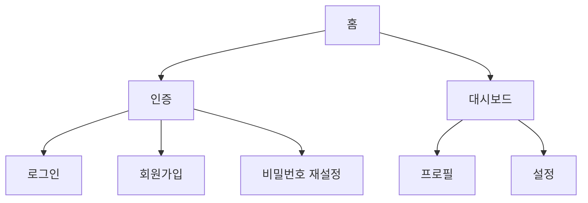
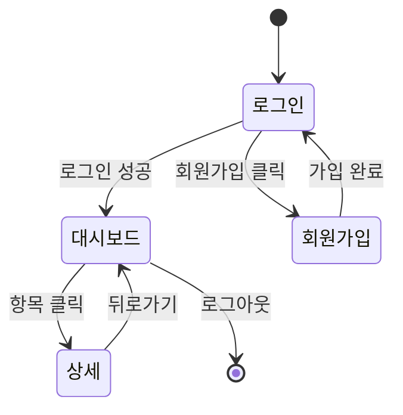

# Screen Design Template — 화면설계서

## 문서 구조

```markdown
# [프로젝트명] — 화면설계서 (Screen Design)

> 버전: 1.0 | 작성일: YYYY-MM-DD | 기반 문서: FUNC-SPEC v1.0

---

## 1. 개요

### 1.1 디자인 시스템
| 항목 | 내용 |
|------|------|
| UI 프레임워크 | [예: React + Tailwind CSS] |
| 컴포넌트 라이브러리 | [예: shadcn/ui] |
| 아이콘 | [예: Lucide Icons] |
| 폰트 | [예: Pretendard (본문), JetBrains Mono (코드)] |

### 1.2 컬러 팔레트
| 용도 | 색상 | 코드 |
|------|------|------|
| Primary | [예: Blue] | #3B82F6 |
| Secondary | [예: Gray] | #6B7280 |
| Success | [예: Green] | #10B981 |
| Warning | [예: Amber] | #F59E0B |
| Error | [예: Red] | #EF4444 |
| Background | [예: White] | #FFFFFF |
| Surface | [예: Gray-50] | #F9FAFB |

### 1.3 반응형 브레이크포인트
| 이름 | 너비 | 대상 |
|------|------|------|
| Mobile | ~640px | 스마트폰 |
| Tablet | 641~1024px | 태블릿 |
| Desktop | 1025px~ | 데스크톱 |

---

## 2. 화면 목록 및 네비게이션

### 2.1 사이트맵



### 2.2 화면 목록
| UI ID | 화면명 | 경로 | 관련 기능 | 인증 필요 |
|-------|--------|------|----------|----------|
| UI-001 | 로그인 | /login | FUNC-001 | N |
| UI-002 | 대시보드 | /dashboard | FUNC-002, FUNC-003 | Y |
| UI-003 | 프로필 | /profile | FUNC-004 | Y |

---

## 3. 화면 상세

### UI-001: [화면명]

#### 기본 정보
| 항목 | 내용 |
|------|------|
| 관련 기능 | FUNC-001 |
| 접근 경로 | /login |
| 인증 | 불필요 |
| 이전 화면 | 홈 (/) |
| 다음 화면 | 대시보드 (/dashboard) |

#### 레이아웃 (ASCII 와이어프레임)

```
┌─────────────────────────────────────┐
│              [로고]                  │
│                                     │
│  ┌─────────────────────────────┐   │
│  │ 이메일                      │   │
│  └─────────────────────────────┘   │
│  ┌─────────────────────────────┐   │
│  │ 비밀번호              [👁]  │   │
│  └─────────────────────────────┘   │
│                                     │
│  [    로그인 버튼 (Primary)    ]   │
│                                     │
│  비밀번호 찾기  |  회원가입         │
│                                     │
│  ──── 또는 ────                     │
│                                     │
│  [  Google 로그인  ]               │
│  [  GitHub 로그인  ]               │
└─────────────────────────────────────┘
```

#### 컴포넌트 목록
| 컴포넌트 | 타입 | 동작 | 유효성 검증 |
|----------|------|------|------------|
| 이메일 입력 | Input (email) | 포커스 시 라벨 상단 이동 | 이메일 형식 검증 |
| 비밀번호 입력 | Input (password) | 눈 아이콘으로 표시/숨김 토글 | 8자 이상 |
| 로그인 버튼 | Button (primary) | 로딩 시 스피너 표시 | 입력 완료 전 비활성 |
| 소셜 로그인 | Button (outline) | OAuth 팝업 열기 | - |

#### 상태별 화면

**기본 상태 (Default)**
- 빈 입력 필드, 로그인 버튼 비활성

**로딩 상태 (Loading)**
- 로그인 버튼에 스피너, 입력 필드 비활성

**에러 상태 (Error)**
- 입력 필드 하단에 빨간 텍스트로 에러 메시지
- 필드 테두리 빨간색

**성공 상태 (Success)**
- 대시보드로 리다이렉트 (화면 전환)

#### 반응형 동작
| 브레이크포인트 | 변경 사항 |
|-------------|----------|
| Mobile | 풀 width 카드, 패딩 축소 |
| Tablet | 중앙 정렬 카드 (max-width: 400px) |
| Desktop | 좌측 브랜드 이미지 + 우측 로그인 폼 |

#### 접근성
- Tab 순서: 이메일 → 비밀번호 → 로그인 → 소셜 로그인
- Enter 키로 로그인 실행
- 스크린 리더: 에러 메시지 aria-live="polite"

---

### UI-002: [화면명]
(위와 동일한 구조)

---

## 4. 공통 컴포넌트

재사용되는 UI 컴포넌트를 정의한다.

### Header / Navigation Bar
```
┌──────────────────────────────────────────┐
│ [로고]  메뉴1  메뉴2  메뉴3    [프로필] │
└──────────────────────────────────────────┘
```
- 모바일: 햄버거 메뉴로 전환

### Toast / 알림
| 유형 | 색상 | 표시 시간 | 예시 |
|------|------|----------|------|
| Success | Green | 3초 | "저장되었습니다" |
| Error | Red | 5초 | "오류가 발생했습니다" |
| Info | Blue | 3초 | "새 알림이 있습니다" |

### Modal / Dialog
- 배경 딤 처리 (opacity 50%)
- ESC 또는 배경 클릭으로 닫기
- 포커스 트랩 (모달 내부에서만 Tab 이동)

---

## 5. 화면 전환 (Navigation Flow)



---

## 6. 화면 추적

| UI ID | FUNC ID | 화면명 | 경로 |
|-------|---------|--------|------|
| UI-001 | FUNC-001 | 로그인 | /login |
| UI-002 | FUNC-002, FUNC-003 | 대시보드 | /dashboard |

---

## 변경 이력

| 버전 | 날짜 | 변경 내용 | 작성자 |
|------|------|----------|--------|
| 1.0 | YYYY-MM-DD | 초안 작성 | [이름] |
```

## 작성 가이드

- **ASCII 와이어프레임 활용**: Markdown 환경에서 시각적 구조를 전달하는 가장 실용적인 방법. 정밀한 디자인이 아니라 레이아웃 의도를 전달하는 것이 목적.
- **상태별 화면 필수**: 모든 화면에 기본/로딩/에러/빈 상태를 정의. 프론트엔드 개발 시 가장 많이 누락되는 부분이 상태 처리.
- **반응형 명시**: 모바일/태블릿/데스크톱에서 레이아웃이 어떻게 변하는지 정의. 반응형을 나중에 추가하면 비용이 3배 이상 든다.
- **접근성 고려**: Tab 순서, 키보드 동작, 스크린 리더 지원을 화면 단위로 정의.
- **디자인 시스템 먼저**: 개별 화면을 그리기 전에 컬러, 타이포그래피, 공통 컴포넌트를 먼저 정의하면 일관성이 유지된다.
