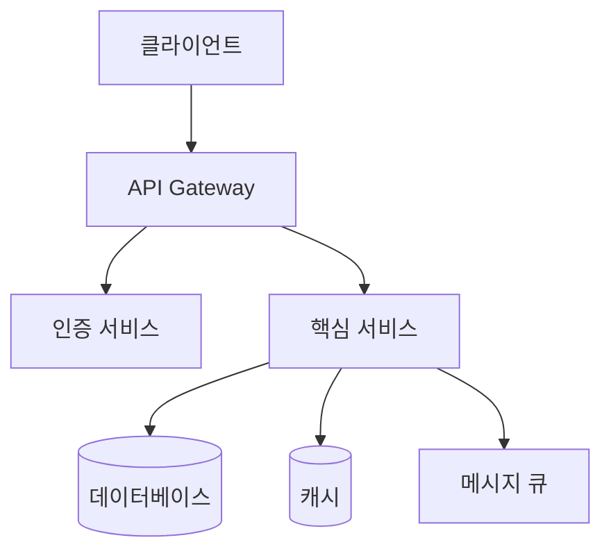
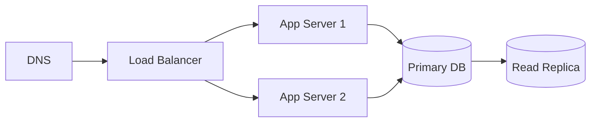
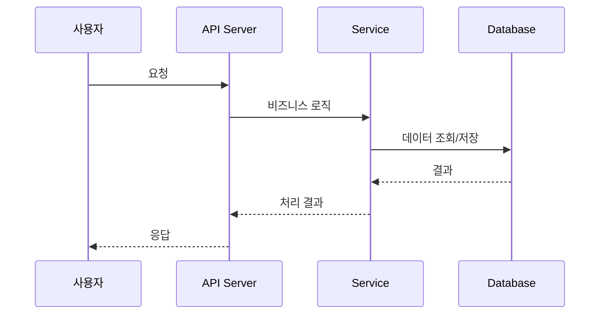

# SDS Template — Software Design Specification

## 문서 구조

```markdown
# [프로젝트명] — SDS (Software Design Specification)

> 버전: 1.0 | 작성일: YYYY-MM-DD | 기반 문서: SRS v1.0

---

## 1. 개요

### 1.1 목적
설계 의사결정과 시스템 구조를 문서화하여 개발팀이 일관된 방향으로 구현할 수 있게 한다.

### 1.2 설계 원칙
이 프로젝트에서 따르는 핵심 설계 원칙 (예: SOLID, KISS, 이벤트 기반 등).
원칙을 나열하되, 이 프로젝트에서 왜 그 원칙이 중요한지 설명한다.

---

## 2. 시스템 아키텍처

### 2.1 아키텍처 개요

아키텍처 패턴 (예: 레이어드, 마이크로서비스, 모노리스 등)과 선택 근거.



### 2.2 기술 스택

| 영역 | 기술 | 선택 근거 |
|------|------|----------|
| Frontend | [예: React + TypeScript] | [근거] |
| Backend | [예: Node.js + Express] | [근거] |
| Database | [예: PostgreSQL] | [근거] |
| Cache | [예: Redis] | [근거] |
| 배포 | [예: Docker + AWS ECS] | [근거] |

### 2.3 배포 아키텍처



---

## 3. 컴포넌트 설계

각 컴포넌트는 SRS의 요구사항을 구현하는 단위.

### DES-001: [컴포넌트명]
- **구현 대상**: REQ-F-001, REQ-F-002
- **책임**: 이 컴포넌트가 담당하는 역할
- **인터페이스**:
  ```
  [주요 인터페이스/API 시그니처]
  ```
- **의존성**: [다른 컴포넌트나 외부 서비스]
- **설계 결정**: [핵심 설계 결정과 그 근거]

### DES-002: [컴포넌트명]
...

---

## 4. 데이터 흐름

### 4.1 주요 데이터 흐름

핵심 유스케이스별 데이터가 시스템을 어떻게 통과하는지 시퀀스 다이어그램으로 표현.



### 4.2 상태 관리
- 클라이언트 상태 관리 전략
- 서버 세션/상태 관리 전략
- 캐시 전략과 무효화 정책

---

## 5. 보안 설계

### 5.1 인증 (Authentication)
- 인증 방식 (JWT, OAuth 2.0, Session 등)
- 토큰 관리 전략

### 5.2 인가 (Authorization)
- 권한 모델 (RBAC, ABAC 등)
- 역할 정의와 권한 매핑

### 5.3 데이터 보호
- 전송 중 암호화 (TLS)
- 저장 시 암호화
- 민감 데이터 처리 (PII 마스킹 등)

---

## 6. 에러 처리 전략

### 6.1 에러 분류
| 분류 | HTTP 코드 | 처리 방식 |
|------|----------|----------|
| 클라이언트 오류 | 4xx | 명확한 에러 메시지 반환 |
| 서버 오류 | 5xx | 로깅 + 알림 + 사용자 안내 |
| 외부 서비스 오류 | - | 재시도 + 서킷 브레이커 |

### 6.2 로깅 전략
- 로그 레벨과 기준
- 구조화된 로깅 형식
- 모니터링/알림 연동

---

## 7. 확장성 및 성능 설계

### 7.1 확장 전략
- 수평 확장 방안
- 데이터 파티셔닝 전략

### 7.2 성능 최적화
- 캐시 레이어 (어디에, 무엇을, 얼마나 오래)
- 비동기 처리 대상
- DB 쿼리 최적화 전략

---

## 8. 설계 추적

| DES ID | 구현 대상 (REQ) | 컴포넌트 |
|--------|----------------|---------|
| DES-001 | REQ-F-001, REQ-F-002 | Auth Module |
| DES-002 | REQ-F-003 | Core Service |

---

## 변경 이력

| 버전 | 날짜 | 변경 내용 | 작성자 |
|------|------|----------|--------|
| 1.0 | YYYY-MM-DD | 초안 작성 | [이름] |
```

## 작성 가이드

- **Mermaid 다이어그램 적극 활용**: 아키텍처, 시퀀스, 상태 다이어그램으로 복잡한 관계를 시각화.
- **"왜"를 설명**: 기술 선택마다 근거를 붙인다. "React를 사용한다" ✗ → "컴포넌트 재사용성과 팀 경험을 고려하여 React를 선택" ✓
- **컴포넌트 경계를 명확히**: 각 컴포넌트의 책임과 인터페이스를 정의해서 팀원이 독립적으로 개발할 수 있게 한다.
- **보안은 별도 섹션**: 보안 설계를 컴포넌트에 흩어놓지 않고 한 곳에 모아서 검토하기 쉽게 한다.
